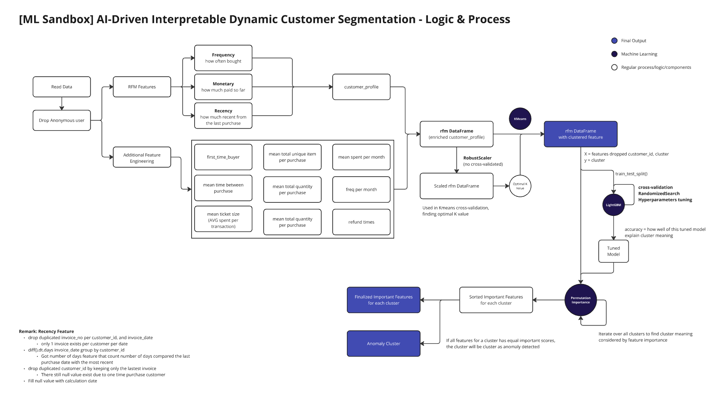
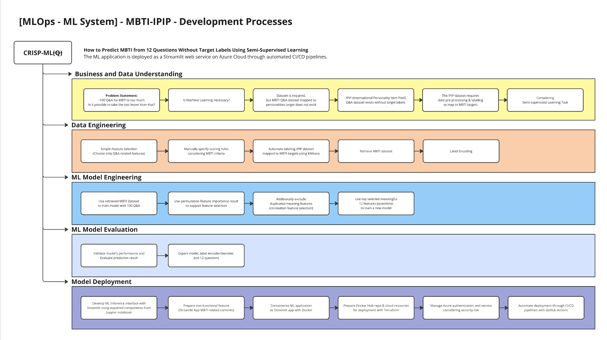
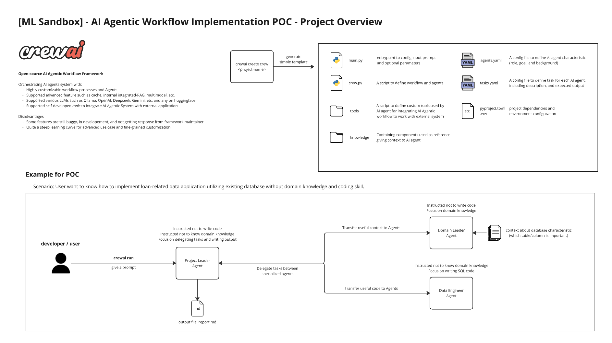

# Machine Learning Sandbox & Research
*by Patcharanat P.*

## Table of Contents
0. **Machine Learning Research**
    - [Machine Learning Development Research](./docs/ML_research.md)
        - ML Development Process & Algorithms
    - [Machine Learning Evaluation](./docs/ML_evaluation.md)
        - Metrics according to specific tasks
    - [Deep Learning Research](./docs/DL_research.md)
1. [Edible or Poisonous Mushroom Classification](#1-edible-or-poisonous-mushroom-classification)
2. [Time Series Forecasting using Regression Model for Temperature Prediction](#2-time-series-forecasting-using-regression-model-for-temperature-prediction)
3. [AI-Driven Interpretable Dynamic Customer Segmentation](#3-ai-driven-interpretable-dynamic-customer-segmentation)
4. [MBTI Classification (MBTI-IPIP)](#3-mbti-classification-mbti---ipip)
5. [Finance](#4-finance)
6. [OpenAI Swarm - POC](#6-openai-swarm)
7. [Agentic Workflow - POC](#7-agentic-workflow)
8. [Basic NN](#8-basic-nn)

## 1. Edible or Poisonous Mushroom Classification
*folder: mushroom*

**Overview**

Since a dataset is downloaded from Kaggle, the dataset is already cleaned and ready to apply to the models. The purpose of this project is only to learn the basics of machine learning models and data-preprocessing approaches. The work would further expand feature engineering, such as feature selection later.

dataset: [Mushroom Classification](https://www.kaggle.com/datasets/uciml/mushroom-classification) *By UCI Machine Learning* from Kaggle

Models used in the project
- DecisionTreeClassifier
- RandomForestClassifier
- ExtraTreesClassifier
- Support Vector Classification (SVC)
- XGBoost Classifier (XGBClassifier)

Aspects learned in the project
- Compared accuracy score between Label encoding and One hot encoding approach
- Hyperparameter tuning
- Using GridSearchCV and RandomizedSearchCV
- Metrics used to evaluated in classification tasks including precision, recall, f-score (f1-score), confusion matrix
- Overfitting checking (accuracy score on a training set and on a test set)

-- see more detail: *mushroom/[mushroom_notebook.ipynb](https://github.com/Patcharanat/ML-Learning/blob/master/mushroom/mushroom_notebook.ipynb)*

## 2. Time Series Forecasting using Regression Model for Temperature Prediction
*folder: regression*

**Overview**

The main purpose of this project is to learn different approach of developing ML model in a regression task which is temperature prediction. The dataset was collected roughly, so there's processes of data cleaning included. Attributes definition of the dataset weren't given, so domain knowledge and comprehensive for data meaning and pattern in this project will be not emphasized. The most represented in this project are **Multivariate Imputer** and **Regression Result Analysis**.

dataset: [Weather Conditions in World War Two](https://www.kaggle.com/datasets/smid80/weatherww2?select=Summary+of+Weather.csv) *By United States National Oceanic and Atmospheric Administration* from Kaggle

Model used in the project
- RandomForestRegressor with Random Search

Aspects learned in the project
- Filling missing value with a Mean or Median value
- Multivariate feature Imputation (IterativeImputer)
- (MSE and MAE explaination)
- A Baseline model & A Benchmark model
- Normalization (MinMaxScaler, RobustScaler, StandardScaler exclude Normalizer)
- Random Forest Tuning
- Using time series cross validation
- Dimensional Reduction with PCA and t-SNE (In progress...)

-- see more detail: *regression/[regression_test.ipynb](https://github.com/Patcharanat/ML-Learning/blob/master/regression/regression_test.ipynb)*

## 3. AI-Driven Interpretable Dynamic Customer Segmentation
*folder: dynamic_segmentation*

- [revised logic notebook](./dynamic_segmentation/revise_ecomm_logic.ipynb)
- Related to [End-to-end E-commerce Data Project - AI-Driven Interpretable Dynamic Customer Segmentation](https://github.com/patcha-ranat/Ecommerce-Invoice-End-to-end)

## 4. MBTI Classification (MBTI - IPIP)
*folder: mbti_ipip*

- [Model development notebook](./mbti_ipip/model_dev.ipynb)
- Related to [MLOps-ml-system](https://github.com/Patcharanat/MLOps-ml-system) project.

About Dataset
- [Big Five Personality Test - Kaggle](https://www.kaggle.com/datasets/tunguz/big-five-personality-test)
- [Local Data Dict](./data/codebook.txt)
- [International Personality Item Pool](https://ipip.ori.org/)
- [Converting IPIP Item Responses to Scale Scores](https://ipip.ori.org/newScoringInstructions.htm)
- [Big-Five Factor Markers - Questions Classification](https://ipip.ori.org/newBigFive5broadKey.htm)
- [Interpreting Individual IPIP Scale Scores](https://ipip.ori.org/InterpretingIndividualIPIPScaleScores.htm)
- [MBTI - Letters personalities explain](https://www.16personalities.com/articles/our-theory)

## 5. Finance
*folder: finance*

*In progress . . .*

dataset: [Financial Transactions Dataset: Analytics](https://www.kaggle.com/datasets/computingvictor/transactions-fraud-datasets) 

## 6. OpenAI Swarm
*folder: [openai_swarm](./openai_swarm/swarm.md)*

Research + POC of AI Agentic Workflow: OpenAI Swarm

## 7. Agentic Workflow
*folder: [agentic_workflow](./agentic_workflow/README.md)*

Research + POC of AI Agentic Workflow: CrewAI

## 8. Basic NN
*folder: [basic_nn](./basic_nn/README.md)*

Learning Neural Network