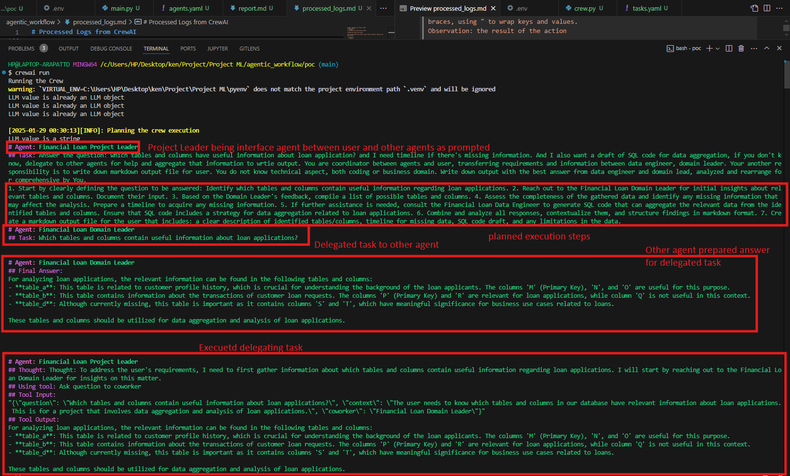

# Agentic Workflow Implementation POC

*Patcharanat P.*


## Output

Markdown Report written by LLMs, answering a prompt inquiring about how to utilize an existing database (with given mock-up detail as context) for loan application by SQL.
- [report.md](./poc/report.md) by LLMs
- POC of how LLMs process, plan execution steps, and delegate tasks to other llm agents



## Getting Started

```bash
# Activate python virtual environment
python venv pyenv
# source pyenv/Scripts/activate

# Install dependencies
make install

# Create CrewAI basic template
# cd ./agentic_workflow
crewai create crew <project-name>

# Execute CrewAI processes
# for more detail, please refer to ./agentic_workflow/poc/README.md 
pip install uv

# Start process
crewai run
```

## Example of Project Structure (including template)

```bash
.
|-- README.md
|   
+---poc
    |-- .env
    |-- pyproject.toml
    |-- README.md
    |   
    +---knowledge
    |   +-- database_detail.txt
    |       
    +---src
    |   +---poc
    |       |-- crew.py
    |       |-- main.py
    |       |
    |       +---config
    |       |   |-- agents.yaml
    |       |   +-- tasks.yaml
    |       |       
    |       +---tools
    |           +-- custom_tool.py
    |               
    +---tests
```

## References
- Example of implementation
    - [Building an Agentic Workflow with CrewAI and Groq](https://www.analyticsvidhya.com/blog/2024/06/agentic-workflow-with-crewai-and-groq/)
- CrewAI official Documentation
    - [installation](https://docs.crewai.com/installation)
    - [quickstart](https://docs.crewai.com/quickstart)
    - [Supported LLMs](https://docs.crewai.com/concepts/llms)
    - [Knowledge Feature - Giving context to AI agents for reference during runtime](https://docs.crewai.com/concepts/knowledge#csv-knowledge-source)
    - [Tools Feature - Tools to allow AI agents to work with external system](https://docs.crewai.com/concepts/tools)
