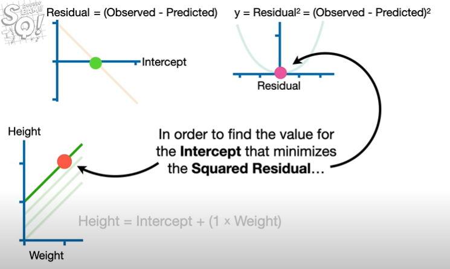

# Deep Learning
*patcharanat p.*

## Table of Contents
- [StatQuest](#statquest-note)
    1. [Introduction](#1-introduction)
    2. [The Chain Rule](#2-the-chain-rule)
    3. [Gradient Descent, Step-by-Step](#3-gradient-descent-step-by-step)
- [IBM Note](#ibm-note)

# StatQuest Note

## 1. Introduction
- Neural Network consist of nodes and connections between nodes
- **Weights** or estimated parameters (**biases**) first are unknown to a neural network model, but when we fitted the specific dataset to the model, it's calculated for us by **Backpropagation**.
- Curved lines, "**Activation Functions**" are shaped into final graph that can fit the data, and there're many common curved lines we can choose for the neural network, such as "**soft plus**", "**ReLU** (Rectified Linear Unit)", and "**sigmoid**".
- Hidden Layers, Hidden Nodes are crucial for anyone who build the NN model.
- There are rules of thumb for making decisions about the Hidden Layers, you essentially make a guess and see how well the NN performs, adding more layers and nodes if needed.
- According to math demonstration, we will see that The neural network starts with identical Activation Functions, but the weights and biases on the connection slice them, flip them and stretch them into new shapes which are then added together to get a new curve that is entirely new and could fit the data.
- So, we could fit any dataset with more hidden layers, and more nodes in each hidden layer.

## 2. The Chain Rule
- The Chain Rule referred to the same topic that we learned in calculus.
    - (dz/dx) = (dz/dy) * (dy/dx)
    - it's all about dependency of rates between multiple variables which can be related with derivative functions.
- The Chain Rule can applies to the **Residual Sum of Squares**, a commonly used **Loss Function** in ML. (dy/dx = 0, then x = the lowest point)

## 3. Gradient Descent, Step-by-Step
- Gradient Descent can fit a line to data by finding the optimal values for the **Intercept** and the **Slope**
    - First, Gradient Descent randomly pickup an intercept point to find sum of the squared Residuals ***(or Loss Function)*** as initial calculation for futher improvement.

# IBM Note

- ML vs DL
    - Human Intervention
        - Classical Machine Learning dependent on human intervention to learn determining a hierarchy of features
        - Deep Learning does not necessarily required human intervention
    - More than 3 layers of Neural Network considered as Deep Learning
    - Feed-Forward

- Back-propagation
    - Weights
    - Activation Functions
    - Biases
        adjust Act. Function aids the network's flexibility
    - Loss Function
        - Error correction
    - Gradient Descent
        - convergence
    - Static & Recurrent
        - Static NN
            - OCR
            - Spam Detection
        - Recurrent NN
            - Sentiment Analysis
            - Time series forecasting

- Foundation Model (FM)
    - GenAI
    - LLM
    - Deepfakes

- Langchain
    - LLM
    - Prompts (few-shot prompt)
    - Chains
    - Index
        - Document Loader
        - Vector DB
        - Text Spliting
    - Memory
    - Agents