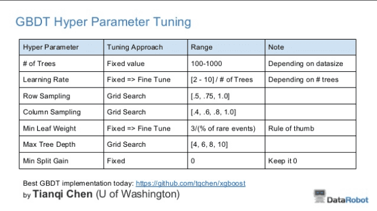
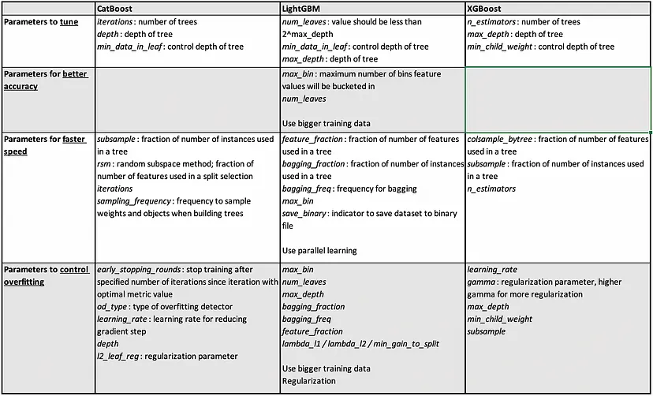

# Machine Learning Research
*Patcharanat P.*

## Table of contents

1. [ML Development Processes](#1-ml-development-processes)
    - [Feature Engineering](#feature-engineering)
        - Missing Value & Data Augmentation
        - [Imbalanced Dataset](#imbalanced-dataset)
        - [Outliers Removal](#outliers-removal)
        - Unstructure Data
        - Scalers
        - Encoding Categorical Data
    - [Hyperparameters Tuning](#hyperparameters-tuning)
    - [Cross-Validation in Machine Learning](#cross-validation-in-machine-learning)
    - [Overfitting and Regularization](#overfitting-and-regularization)
    - [Correlation Coefficiency](#correlation-coefficiency)
    - [Exporting an ML model as a file](#exporting-an-ml-model-as-a-file)
    - [ML Evaluation Visualization](#ml-evaluation-visualization)
2. [ML Models / Algorithms](#2-ml-models--algorithms)
    - [Decision Tree](#decision-tree)
    - [Random Forest](#random-forest)
    - [GBM](#gradient-boosting)
        - [AdaBoost](#adaboost)
        - [XGBoost](#xgboost)
        - [Lightgbm](#lightgbm)
        - [Catboost](#catboost)
        - [XGBoost vs CatBoost vs LightGBM](#xgboost-vs-catboost-vs-lightgbm)
    - Linear Regression → linear regression
    - Logistic Regression → linear classification
    - Naive Bayes → probability
    - [K-Means](#k-means)
    - [Agglomerative Hierarchichy Clustering](#agglomerative-hierarchichy-clustering)
    - [PCA (Principle Components Analysis) → Linear dimensionality reduction](#pca-principle-components-analysis)
    - [KernelPCA (Non-Linear)](#kernel-pca)
    - [KNN (K Nearest Neighbors)](#knn-k-nearest-neighbors)
    - [Anomaly Detection](#anomaly-detection)
        - [Outlier Detection](#outlier-detection)
        - [Novelty Dectection](#novelty-detection)
    - [ARIMA (Autoregressive Integrated Moving Average Model)](#arima-autoregressive-integrated-moving-average-model)
3. [Applications](#3-applications)
    - [Association Rule](#association-rule)
    - [Time series Forecasting Features](#time-series-forecasting-features)
    - [Product Recommendation](#product-recommendation)

## 1. ML Development Processes

ML development involves multiple steps including other processes, beside finding the best algorithm for the dataset, which are:
- Feature Engineering
- Feature Selection
- Model Creation
- [Hyperparameter Tuning](https://www.naukri.com/learning/articles/hyperparameter-tuning-beginners-tutorial/)
- Model Deployment
- Incremental Learning

Most Topics are elaborated in this docs, but some are still waiting for further explroation, and some are linked to another related repository.

### Feature Engineering

Feature Engineering steps
1. Exploratory Data Analysis
    - Profiling dataset, exploring dataset characteristic
2. [Handling missing values](https://www.naukri.com/learning/articles/handling-missing-values-beginners-tutorial/)
    - Drop null values, Fill with statistic values (mean/median), imputed by ML techniques
3. Handling imbalanced dataset
4. Handling outliers
5. Unstructured manner
6. Scaling down the data (Standardization and Normalization)
7. [Converting categorical data to numerical data (One hot encoding, Label encoding)](https://www.naukri.com/learning/articles/one-hot-encoding-vs-label-encoding/)
8. Feature extraction (This is not exactly included in feature engineering)

#### Imbalanced Dataset

- Choose Proper Evaluation Metric: For an imbalanced class dataset F1 score
- Resampling (Oversampling and Undersampling):
    - we can randomly delete rows from the majority class to match them with the minority class which is called undersampling.
    - we can oversample the minority class using replacement. This technique is called oversampling.
    - Using resample() from sklearn.utils
        
        ```python
        from sklearn.utils import resample()
        #create two different dataframe of majority and minority class 
        df_majority = df_train[(df_train['Is_Lead']==0)] 
        df_minority = df_train[(df_train['Is_Lead']==1)] 
        # upsample minority class
        # 0: 131177, 1: 40830
        df_minority_upsampled = resample(df_minority, 
                                         replace=True,    # sample with replacement
                                         n_samples= 131177, # to match majority class
                                         random_state=0)  # reproducible results
        # Combine majority class with upsampled minority class
        df_upsampled = pd.concat([df_minority_upsampled, df_majority])
        ```
        
    - Using SMOTE: Synthetic Minority Oversampling Technique from *imblearn*
    - Using BalancedBaggingClassifier from *imblearn* together with selected estimator
    - Threshold moving

#### Outliers Removal

- Removal
    - remove +- 3 std from normal distribution
    - boxplot → remove dot plot (1.5IQR is considered)
    - remove 1st percentile and 99th percentile
    - **use Z-score when there're no extreme outliers**
    - **use IQR when there're extreme outliers**

    ```python
    import numpy as np
    import from scipy import stats
    
    # Z-score
    # assume data = DataFrame
    z = np.abs(stats.zscore(data_column)) 
    threshold = 3
    outliers = np.where(z > threshold)
    
    # DataFrame with no oulier
    data_without_outliers = data[(z < threshold).all(axis=1)]

    # IQR
    # define the upper and lower bound
    Q1 = df['col_name'].quantile(0.25)
    Q3 = df['col_name'].quantile(0.75)
    IQR = Q3 - Q1
    lower = Q1 - 1.5*IQR
    upper = Q3 + 1.5*IQR
    
    # Create arrays of Boolean values indicating the outlier rows
    upper_array = np.where(df['col_name']>=upper)[0]
    lower_array = np.where(df['col_name']<=lower)[0]
    
    # Removing the outliers
    # Removing the outliers
    df = df.drop(index=upper_array)
    df = df.drop(index=lower_array)

    ```

- Log-Transformation should be taken first before removal.
- Use tree-based method model will less impacted by outlier.

### Hyperparameters Tuning

- In a true machine-learning fashion, you’ll ideally ask the machine to perform this exploration and select the optimal model architecture automatically.
- Grid Search & Random Search
    - “*….for most datasets only a few of the hyper-parameters really matter, but that different hyper-parameters are important on different datasets. This phenomenon makes grid search a poor choice for configuring algorithms for new datasets*.”
    - *that random experiments are more efficient because not all hyperparameters are equally important to tune. - - random search found better models in most cases and required less computational time.*
    - https://www.jmlr.org/papers/volume13/bergstra12a/bergstra12a.pdf
    - GridSearchCV - iterating grid to select the best parameters
        
        ```python
        param_grid = [{
        	hyperparameter1: ["Range of hyperparameters"],
        	hyperparameter2: ["Range of hyperparameters"],
        	hyperparameter3: ["Range of hyperparameters"]
        }]
        
        # the model is a model that we choose and imported
        grid = GridSearchCV(estimator=model, param_grid=param_grid, cv=3, n_jobs=-1)
        # scoring parameter available
        
        grid.fit(X_train, y_train)
        
        # new model is best_estimator
        best_estimator = grid.best_estimator_
        
        best_estimator.fit(X_train, y_train)
        
        best_estimator.predict(X_test)
        
        # grid.best_score_
        # grid.best_params_
        ```
        
    - RandomizedSearchCV
        - The number of parameter settings that are sampled is given by `n_iter`. Sampling without replacement is performed when the parameters are presented as a list (like the grid search). But if the parameter is given as a distribution, sampling with replacement is used (recommended).
        
            ```python
            from sklearn.model_selection import RandomizedSearchCV
            from scipy.stats import loguniform, randint

            n_iter = 70

            param_dist = {
                "learning_rate": loguniform(1e-4, 0.1),
                "n_estimators": randint(100,1000),
                "max_depth": randint(4, 400) 
            }

            # Random
            reg_rand = RandomizedSearchCV(model,
                                    param_distributions=param_dist,
                                    n_iter=n_iter,
                                    cv=5,
                                    n_jobs=-1,
                                    scoring='roc_auc',
                                    random_state=0)
            ```
        
- Bayes Search
    - Optimize parameter
    - computational time < grid search
    - Bayes Search → Optimize Search (scikit-optimize)
        
        ```python
        from skopt import BayesSearchCV
        
        param_grid = {
            "learning_rate": (0.0001, 0.1, "log-uniform"),
            "n_estimators": (100,  1000) ,
            "max_depth": (4, 400) 
        }

        reg_bay = BayesSearchCV(estimator=pipe,
                            search_spaces=param_grid,
                            n_iter=n_iter,
                            cv=5,
                            n_jobs=-1,
                            scoring='roc_auc',
                            random_state=0)

        model_bay = reg_bay.fit(X, y)
        
        # bayes_search.best_params_
        # bayes_search.best_estimator_
        ```
        

### Cross-Validation in Machine Learning

- ***You need some kind of assurance that your model has got most of the patterns from the data correct, and its not picking up too much on the noise, or in other words its low on bias and variance.***
- ***This significantly reduces bias as we are using most of the data for fitting, and also significantly reduces variance as most of the data is also being used in validation set.***
- the result may decrease performance due to regularization
- K-Fold Validation
    - **As a general rule and empirical evidence, K = 5 or 10 is generally preferred.**
- Stratified K-Fold Validation
    - ***a slight variation in the K Fold cross validation technique is made, such that each fold contains approximately the same percentage of samples of each target class as the complete set, or in case of prediction problems, the mean response value is approximately equal in all the folds.*** This variation is also known as **Stratified K Fold**.
    - For Imbalanced dataset
- Leave-P-Out Cross-Validation
    - *This method is exhaustive in the sense that it needs to train and validate the model for all possible combinations, and for moderately large p, it can become computationally infeasible.*
    - p = 1 → Leave one out cross validation
        - more preferred → ***it does not suffer from the intensive computation, as number of possible combinations is equal to number of data points in original sample or n.***

### Overfitting and Regularization

- Overfitting happens when model learns signal as well as noise in the training data and wouldn’t perform well on new data on which model wasn’t trained on.
- To avoid overfitting:
    - cross-validation sampling
    - reducing number of features
    - pruning
    - regularization: adds the penalty as model complexity increase
- L1 and L2 Regularization; *The key difference between these two is the penalty term.*
    
    These techniques are a great alternative when dealing with a large set of features 
    
    - L1: Lasso Regression
        - adds “*absolute value of magnitude*” of coefficient as penalty term to the loss function.
        - this works well for **feature selection** in case we have a huge number of features.
    - L2: Ridge Regression
        - adds “*squared magnitude*” of coefficient as penalty term to the loss function.

### Correlation Coefficiency

- Correlation = Normalized Covariance (by the standard deviation of variables)
- All thresholds are approximately > 0.5, 0.7 that should be counted as acceptable
- Correlation indicates strength and direction between variables, locating between [-1, 1]
- Pearson:
    - evaluate the linear relationship between 2 continuous variables
    - the more value of correlation coeff. indicates how perfect a linear relationship is
- Spearman:
    - evaluate the monotonic relationship between 2 continuous variables which are not strictly linear
    - the more value of correlation coeff. indicates how perfect a monotonic relationship is
    - monotonic relationship: when one variable increases, the other variable either increases or decreases
- Kendall:
    - Kendall's correlation coefficient is a rank-based measure that quantifies the dependence relationship between variables based on the similarity of their rankings. It is especially useful when dealing with non-linear or ordinal data.
    - It provides a measure of dependence that is based on the order of the data rather than their actual values.
    - Kendall's correlation coefficient is specifically designed for ranked or ordinal data, where the focus is on the order or ranking of the values rather than their specific numerical differences.
        ```python
        # Correlation with the output variable
        cor_target = abs(cor["output_col_name"])
        
        # Selecting highly correlated features
        relevant_features = cor_target[cor_target>=0.25]
        selected_input = relevant_features.index # selected columns' name
        ```
- [Auto-correlation](#time-series-forecasting-features)

### Exporting an ML model as a file

- Export Model by joblib

```python
import joblib

# export model
joblib.dump(model, "model_name.model")

# load model
loaded_model = joblib.load("model_name.model")

# use model
loaded_model.predict(...)
```

- Export Tabular by parquet (recommended)

```python
# need to "pip install pyarrow" first

# assume "df" is a tabular we need to export
df.to_parquet("file_name.parquet")

# to read a parquet file
import pandas as pd
df = pd.read_parquet("file_name.parquet")
```

### ML Evaluation Visualization

- PCA: Principal Component Plot*
- Validation Curve*
- Learning Curve*
- Elbow plot*
- Silhouette Plot
- Class Imbalance plot*
- Residuals Plot
- Prediction Error plot
- Cook’s Distance plot - check outlier
- Feature importance plot*

## 2. ML Models / Algorithms

### Decision Tree
tend to overfit → use random forest instead

- criterion (gini)
metric for impurity → use both and compare, performance depends on dataset
    - Classifier
        - gini
        - entropy
    - Regression
        - squared_error
        - absolute_error
- splitter (best)
the algorithm considers all the features and chooses the best split. If you decide to set the splitter parameter to “random,” then a random subset of features will be considered. The split will then be made by the best feature within the random subset.
    - best
    - random
- max_depth (None)
prevent overfitting
    - range(2, 10)
- min_sample_split: (2)
The minimum number of samples a node must contain in order to consider splitting. You can use this parameter to regularize your tree.
- min_sample_leaf: (1)
The minimum number of samples needed to be considered a leaf node. Use this parameter to limit the growth of the tree.
- max_features: 
The number of features to consider when looking for the best split. If this value is not set, the decision tree will consider all features available to make the best split. Depending on your application, it’s often a good idea to tune this parameter.
    - m = max_features, p = n_features
    - Recommended default values are m = p/3 for regression problems and m = √p for classification problems (attributed to Breiman)
    - The best value of m depends on the problem, so m should be treated as a tuning parameter.
        - more explain in: https://stats.stackexchange.com/questions/324370/references-on-number-of-features-to-use-in-random-forest-regression

### Random Forest
- Basic Robust model
- Random forest is an ensemble tool which takes a subset of observations and a subset of variables to build a decision trees.
- A big insight into bagging ensembles and random forest was allowing trees to be greedily created from subsamples of the training dataset.
- Tuning parameters
    - max_features: The maximum number of features Random Forest is allowed to try in individual tree.
        - None, ‘sqrt’, 0.1→1.0 (percent)
    - n_estimators: This is the number of trees you want to build before taking the maximum voting or averages of predictions.
        - default: 100
    - min_samples_leaf: Leaf is the end node of a decision tree. A smaller leaf makes the model more prone to capturing noise in train data.
        - value depends on an individual dataset (default: 4)
- reducing computationally cost by n_jobs or decreasing n_estimators
- OOB score (Out of Bag): unlike the cross-validation test that trains and evaluates different subsets within the data, Out of Bag Method is an evaluation method that tested with unseen data that isn’t used for a trained model showing how well the model performs on *Never seen* data.

### Gradient Boosting
**How Gradient Boosting Works**

1. A loss function to be optimized.
2. A weak learner to make predictions.
3. An additive model to add weak learners to minimize the loss function.

**Improve a model by reducing overfitting**

1. Tree Constraint: Reducing capable of individual trees and using more n_estimators
    - Number of trees, The advice is to keep adding trees until no further improvement is observed.
    - Tree depth, deeper trees are more complex trees and shorter trees are preferred. Generally, better results are seen with 4-8 levels.
    - Number of nodes OR number of leaves, this can constrain the size of the tree, but is not constrained to a symmetrical structure if other constraints are used.
    - Number of observation per split, a minimum constraint on the amount of training data at a training node before a split can be considered
    - Minimum improvement to loss
2. Weighted Updates
    - The contribution of each tree to this sum can be weighted to slow down the learning by the algorithm. This weighting is called a shrinkage or a learning rate.
    - a configuration trade-off between the number of trees and learning rate.
    - It is common to have small values in the range of 0.1 to 0.3, as well as values less than 0.1.
3. Stochastic Gradient Boosting
    - The same benefit from bagging algorithm, stochastic can be used to reduce the correlation between the trees in the sequence in gradient boosting models.
    - *at each iteration a subsample of the training data is drawn at random (without replacement) from the full training dataset. The randomly selected subsample is then used, instead of the full sample, to fit the base learner.*
    - A few variants of stochastic boosting that can be used:
        - Subsample rows before creating each tree.
        - Subsample columns before creating each tree
        - Subsample columns before considering each split.
    - Generally, aggressive sub-sampling such as selecting only 50% of the data has shown to be beneficial.
4. Penalized Gradient Boosting
    - L1 regularization of weights
    - L2 regularization of weights

**General parameters to tune for Gradient Boosting algorithm**

Studies in the paper preferred a shrinkage value of 0.1, a number of trees in the range 100 to 500 and the number of terminal nodes in a tree between 2 and 8.

- The number of trees or estimators in the model.
- The learning rate of the model.
    - *The “shrinkage” parameter 0 < v < 1 controls the learning rate of the procedure. Empirically …, it was found that small values (v <= 0.1) lead to much better generalization error.*
- The row and column sampling rate for stochastic models. (Subsample)
    - *… the best value of the sampling fraction … is approximately 40% (f=0.4) … However, sampling only 30% or even 20% of the data at each iteration gives considerable improvement over no sampling at all, with a corresponding computational speed-up by factors of 3 and 5 respectively.*
    - *Also, as in Friedman’s stochastic gradient boosting paper, they recommend a subsampling percentage (n) without replacement with a value of about 50%.*
- The maximum tree depth.
- The minimum tree weight.
- The regularization terms alpha and lambda.
- max_features (0.0, 1.0]
    - Choosing `max_features < n_features` leads to a reduction of variance and an increase in bias.
- number of terminal nodes (max_leaf_nodes)
    - *In both cases the optimal tree size as averaged over 100 targets is L = 6. Increasing the capacity of the base learner by using larger trees degrades performance through “over-fitting”.*
    - *They comment that a good value the number of nodes in the tree (J) is about 6, with generally good values in the range of 4-to-8.*
- trade-off between learning rate and number of trees
    - *In fact, the best strategy appears to be to set v to be very small (v < 0.1) and then choose M by early stopping.*

*Papers*

- [Stochastic Gradient Boosting](https://www.sciencedirect.com/science/article/pii/S0167947301000652), 2002.
- [XGBoost: A Scalable Tree Boosting System](https://arxiv.org/abs/1603.02754), 2016.
- [LightGBM: A Highly Efficient Gradient Boosting Decision Tree](https://papers.nips.cc/paper/6907-lightgbm-a-highly-efficient-gradient-boosting-decision-tree), 2017.
- [CatBoost: gradient boosting with categorical features support](https://arxiv.org/abs/1810.11363), 2017.

### AdaBoost
The First Boosting Algorithm

- *AdaBoost works by weighting the observations, putting more weight on difficult to classify instances and less on those already handled well. New weak learners are added sequentially that focus their training on the more difficult patterns.*
- *The most successful form of the AdaBoost algorithm was for binary classification problems and was called AdaBoost.M1.*
- AdaBoost is best used in a dataset with low noise, when computational complexity or timeliness of results is not a main concern and when there are not enough resources for broader hyperparameter tuning due to lack of time and knowledge of the user.
- The number of weak learners is controlled by the parameter `n_estimators`. The `learning_rate`
 parameter controls the contribution of the weak learners in the final combination.
- The main parameters to tune to obtain good results are `n_estimators`
 and the complexity of the base estimators (e.g., its depth `max_depth`
 or minimum required number of samples to consider a split `min_samples_split`).
- base_estimator; default = DecisionTree

### GBM (scikit-learn)
There are many parameters, but this is the default configuration for the algorithm in this library.

- learning_rate=0.1 (shrinkage).
- n_estimators=100 (number of trees).
- max_depth=3.
- (int → number of samples, float → fraction) the more value → the simpler model
    - min_samples_split=2. [2, 10% of samples (rows)]
    - min_samples_leaf=1. [1, 5% of samples (rows)]
- subsample = 1.0
- max_leaf_nodes coresponding with max_depth; *We found that max_leaf_nodes=k gives comparable results to max_depth=k-1 but is significantly faster to train at the expense of a slightly higher training error.*
- Use HistGradientBoosting instead for a Large dataset

### XGBoost
- *The main difference between GradientBoosting is XGBoost is that XGboost uses a regularization technique in it.*
- Asymmetric tree growth (level-wise tree growth)
- **n_estimators**: The number of trees in the ensemble, often increased until no further improvements are seen.
- **max_depth**: The maximum depth of each tree, often values are between 1 and 10.
- **eta**: The learning rate used to weight each model, often set to small values such as 0.3, 0.1, 0.01, or smaller.
- **subsample**: The number of samples (rows) used in each tree, set to a value between 0 and 1, often 1.0 to use all samples.
- **colsample_bytree**: Number of features (columns) used in each tree, set to a value between 0 and 1, often 1.0 to use all features.
- default parameters
    - eta (learning rate): 0.3 / range: [0, 1]
    - gamma (min_split_loss): 0 / range: [0, infinity]
    - max_depth: 6 / range: [0, infinity]
    - min_child_weight: 1 / range: [0, infinity]
    - max-delta_step: 0 / range: [0, infinity]
    - subsample: 1 / range: (0, 1]
    - sampling_method: uniform: uniform /  options: [uniform, gradient_based]
    - colsample_bytree, colsample_bylevel, colsample_ bynode: 1 / range: (0, 1]
    - lambda (reg_lambda): 1 → L2 regularization
    - alpha (reg_alpha): 0 → L1 regulatization
    - tree_method: auto / options: [auto, exact, approx, hist, gpu_hist]
    - scale_pos_weight: 1
    - updater:
    - refresh_leaf: 1
    - process_type: default
    - grow_policy: depthwise
    - max_leaves: 0
    - max_bin: 256
    - predictor: auto
    - num_parallel_tree: 1
    - monotone_constraints
    - interaction_constraints
- 3 the most important parameters to tune
    - Number of trees.
    - Tree depth.
    - Step Size (learning rate).
- Strategy to tune
    
    Tong in TechEd Europe
    
    1. Run the default configuration (and presumably review learning curves?).
    2. If the system is overlearning, slow the learning down (using shrinkage?).
    3. If the system is underlearning, speed the learning up to be more aggressive (using shrinkage?).
    
    or Owen Zhang in Data Science Academy in 2015
    
    - learning rate + number of trees: Target 500-to-1000 trees and tune learning rate.
    - number of samples in leaf: the number of observations needed to get a good mean estimate.
    - interaction depth: 10+.
    
    
    
    **Summary**
    
    - eta (learning rate) + number of trees (n_estimators)
        - Examine objective metrics in training/validation to quickly find good configuration
        - target around 100 trees
    - max_depth: start with 6
    - min_child_weight: start with (1/sqrt(event_rate))
    - colsample_bytree (0.3-0.5)
    - subsampling (leave at 1.0)
    - gamma: usually it is OK to leave at 0
- Control Overfitting
    
    There are in general two ways that you can control overfitting in XGBoost:
    
    - The first way is to directly control model complexity.
        - This includes `max_depth`, `min_child_weight` and `gamma`.
    - The second way is to add randomness to make training robust to noise.
        - This includes `subsample` and `colsample_bytree`.
        - You can also reduce stepsize `eta`. Remember to increase `num_round` when you do so.

### CatBoost
- In Catboost, the main difference that makes it different and better than others is the growing of decision trees in it. In CatBoost the **decision trees which is grown are symmetric.**
- CatBoost is a boosting algorithm that performs exceptionally very well on categorical datasets. In CatBoost, the categorical features are encoded on the basis of the output columns. So while training or encoding the categorical features, the weightage of the output column will also be considered which makes it higher accurate on categorical datasets.
- **Greedy search for combination:** CatBoost also automatically combines categorical features, most times two or three. To keep possible combinations limited, CatBoost does not enumerate through all the combinations but rather some of the best, using statistics like category frequency. So, for each tree split, CatBoost adds all categorical features (and their combinations) already used for previous splits in the current tree with all categorical features in the dataset.
- ranking objective function
- native categorical features preprocessing
- model analysis
- fastest prediction time
- hyperparameters
    - **`iterations`**: equal to n_estimators in xgboost, validation curve is suggested for selection
    - **`learning_rate`**: (2-10)/#of_iterations [0.01, 0.3]
    - **`depth`**: In most cases, the optimal depth ranges from 4 to 10. Values in the range from 6 to 10 are recommended.
    - **`min_data_in_leaf`**: This hyperparameter controls the minimum number of samples in each leaf node of the decision trees. A higher value may lead to better generalization, but may also lead to underfitting. A lower value may lead to overfitting. A reasonable range to search over could be [1, 50].
    - **`subsample`**: This hyperparameter controls the fraction of samples used for each tree in the ensemble. A lower value may lead to better generalization, but may also lead to underfitting. A higher value may lead to overfitting. A reasonable range to search over could be [0.1, 1.0].
    - **`rsm`**: This hyperparameter controls the fraction of features used for each tree in the ensemble. A lower value may lead to better generalization, but may also lead to underfitting. A higher value may lead to overfitting. A reasonable range to search over could be [0.1, 1.0].
    - **`sampling_frequency`**: This hyperparameter controls how often to use the bagging procedure during training. A higher value may lead to better generalization, but may also lead to underfitting. A lower value may lead to overfitting. A reasonable range to search over could be [0.1, 1.0].
    - **`l2_leaf_reg`**: This hyperparameter controls the L2 regularization strength. A higher value may lead to better generalization, but may also lead to underfitting. A lower value may lead to overfitting. A reasonable range to search over could be [0.1, 10.0].
    - etc: don’t forget to use early_stopping_rounds, eval_metric, and eval_set

### LightGBM
- It is based on three important principles:
    - Weak learners (decision trees)
    - Gradient Optimization
    - Boosting Technique
- Asymmetric tree growth (leaf-wise tree growth)
    - while XGBoost uses depth-wise tree growth. Leaf-wise method allows the trees to converge faster but the chance of over-fitting increases.
- Performs well on categorical datasets
- faster in training time and suitable for large dataset (> 10,000 samples)
- GOSS (One-Side Sampling)
    - LightGBM uses a novel technique of Gradient-based One-Side Sampling (GOSS) to filter out the data instances for finding a split value while XGBoost uses pre-sorted algorithm & Histogram-based algorithm for computing the best split. Here instances mean observations/samples.
    - GOSS keeps all the instances with large gradients and performs random sampling on the instances with small gradients.
    - The standard gbdt is reliable but it is not fast enough on large datasets. Hence, goss suggests a sampling method based on the gradient to avoid searching for the whole search space. We know that for each data instance when the gradient is small that means no worries data is well-trained and when the gradient is large that should be retrained again. So we have **two sides** here, data instances with large and small gradients. Thus, goss keeps all data with a large gradient and does a random sampling (**that’s why it is called One-Side Sampling**) on data with a small gradient. This makes the search space smaller and goss can converge faster.
    - In a nutshell GOSS retains instances with large gradients while performing random sampling on instances with small gradients.
- Tuning parameters
    - num_iterations
    - lambda_l1
    - num_leaves: num_leaves = 2**(max_depth)
        - LightGBM is the leaf-wise tree growth. **As a result, It is necessary to tune num_leaves with the max_depth together.**
    - min_data_in_leaf
    - subsample (bagging fraction)
    - feature_fraction
    - max_depth
    - max_bin
    - (early_stopping_rounds)
    - categorical_feature
    - handling imbalanced by is_unbalance and scale_pos_weight

### XGBoost vs CatBoost vs LightGBM
- computational time: XGBoost (Slowest) > LightGBM ~ CatBoost (Fastest) (depends on dataset)
- parameters to Tune
    
    
    | Function | CatBoost | XGBoost | LightGBM |
    | --- | --- | --- | --- |
    | Parameters controlling overfitting | – learning_rate
    – depth
    – l2_reg | – learning_rate
    – max_depth
    – min_child_weight | – learning_rate
    – Max_depth
    – Num_leaves
    – min_data _in_leaf |
    | Parameters for handling categorical values | – cat_features
    – one_hot_max_size | N/A | Categorical_feature |
    | Parameters for controlling speed | – rsm
    – iteration | – colsample_bytree
    – subsample
    – n_estimators | – feature_fraction
    – bagging fraction
    – num_iterations |
    
    
    

### K-Means
- Unsupervised Learning
- Normalization helps to make a better result (check by ARI (adjusted_rand_score))
- find the optimal K by elbow plot (plot K and Inertia_)
- Weakness
    - need pre-defined K
    - sensitive to outliers
- 2 Properties of good clustering
    - distance from points in a cluster should be as low as possible
    (final inertia value = sum of intracluster distances (euclidian distance))
    - distance from clusters should be as high as possible
    (Dunn Index = minimum inter-cluster distance / maximum intra-cluster distance)
    the more value of the dunn index, the better the cluster will be.
- Check similarity of samples within a cluster by Silhouette Score
    - The higher indicate that the clusters are well separated and each sample is more similar to the samples in its own cluster than to samples in other clusters
    - the closer to 0 suggesting and negative value suggest a poor clustering solutions
- Optimization plays a role of finding the best set of centroids that minimize the sum of squared distances

### Agglomerative Hierarchichy Clustering
- Unsupervised Learning to **cluster data with no prior number of clusters (K) needed like K-Means**
- The algorithm can be calcuclated by:
    1. Calculate the distance matrix of all samples
    2. Merge the two closest samples into a cluster
    3. Update the distance matrix
    4. Repeat steps 2 and 3 until all samples are merged into a single cluster
- There're many approaches to calculate the distance between clusters which every approach has its own pros and cons
    - Single Linkage: distance between two closest points in each cluster
    - Complete Linkage: distance between two farthest points in each cluster
    - Average Linkage: average distance between all points in each cluster
    - Ward Linkage: minimize the variance in each cluster
- Clustering can be explained by dendrogram (and linkage matrix (proximity table))
- To choose number of cluster, we generally draw a horizontal line that passes through longest vertical line (the maximum distance between clusters) in dendrogram and count the number of vertical lines that it crosses. The number of vertical lines will be the number of clusters.

***Note:***
- There's also Divisive Clustering which is the opposite of Agglomerative Clustering which is not popular in real world application.
- Hierarchical clustering is not suitable for large datasets because of its computational complexity which makes K-Means is more proper for large datasets.
- Hierarchical clustering is more stale than K-means to reproduce the same result, because the algorithm is not based on random initialization.

### PCA (Principle Components Analysis)
- used in dimensions reduction for linear relationship between variables (features) which not suit to real-case scenario
- Mathematical step to perform PCA
    1. Calculate Cov (covariance) between all features, in which return Cov Matrix
    2. solve equation C*V = λ*V to find eigen value and eigen vector
        - singular → det = 0
    3. use eigen value to define how features important (well explained data) compared with other feature
- should scale data before using pca
- conceptual note from gpt
    - The **`explained_variance_ratio_`** values in PCA represent the proportion of the variance in the original data explained by each principal component. They indicate the relative importance of each principal component, rather than the importance of individual features.
        
        Therefore, the **`explained_variance_ratio_`** values reflect the importance of the principal components, while the coefficients in the **`components_`** matrix provide insights into the importance of individual features within the context of each principal component.
        
    - Each principal component is a linear combination of the original features, and by retaining a subset of components, you are selecting a reduced set of transformed features. These transformed features are combinations of the original features that capture the most important patterns or variances in the data.
        
        However, it's important to note that retaining a subset of components does not remove any features from the dataset itself. The dimensionality reduction is achieved by reducing the number of transformed features used in subsequent analysis or modeling, but all the original features are still available for reference and can be used if needed.
        
    - discarding components in the context of PCA, we are not discarding any original features from the dataset. Instead, we are discarding some of the transformed components or dimensions that are obtained through the PCA process.
    - n_components doesn’t need to equal to number of features, the criterion that should be determined are:
        - Variance Retention: choose the number of components that explain a certain percentage of the total variance in the dataset
        - Scree plot: iterate over n_components and choose the elbow of the plot
        - Cumulative Explained Variance
        - Cross-validation and choosing the wanted score
- Practical Code:
    
    ```python
    from skelarn.decomposition import PCA
    
    # df = pd.read_csv(...)
    # X = input dataframe, y = output
    # X_train, X_test, y_train, y_test = train_test_split(X, y, test_size=0.2)
    
    # plot scree plot to choose n_components: N
    pca = PCA(n_components=N)
    # arguments: svd_solver
    
    # Don't forget to scale data (train-test separately) before using in PCA
    X_pca = pca.fit_transform(X_train_scaled)
    
    # model = XGBoostClassifier()
    model.fit(X_pca, y_train)
    
    prediction = model.predict(X_test_scaled)
    
    print(accuracy_score(y_test, prediction))
    ```
    
### Kernel PCA
- allowing it to capture more complex and nonlinear relationships between the data points.
- hyperparameters:
    - n_components
        - number of dataframe columns
    - kernel
        - Default: linear
        - poly, rbf, sigmoid, cosine, precomputed
    - gamma → for rbf, poly, sigmoid
        - Default: None → 1/n_features

### KNN (K-Nearest Neighbors)
- often used in imputation, but also can be used in regression, and classification task
    - regression
    - classification → majority vote which class it should fall into
- It is based on the idea that the observations closest to a given data point are the most "similar" observations in a data set, and we can therefore classify unforeseen points based on the values of the closest existing points.
- the larger k, the more robust to outliers and produce more stable dicision boundaries

### Anomaly Detection

#### Outlier Detection
- Isolation Forest
    - use `n_estimators` trees to specify which records are not align with the others
    - use `contamination` [0, 1] to specify the percentage of outliers we need to detect
    ```python
    from sklearn.ensemble import IsolationForest

    if_detector = IsolationForest(n_estimators=10, contamination=0.1).fit(X)
    if_detect = if_detector.predict(X)
    ```
- Local Outlier Factor (LOF)
    - use density to specify the anomaly which may locate in lower density area
    - `n_neighbors`: number of neighbors, and `contamination`: percentage of outliers
    ```python
    from sklearn.neighbors import LocalOutlierFactor

    lof_detector = LocalOutlierFactor(n_neighbors=20, contamination=0.1)
    lof_detect = lof_detector.fit_predict(X)
    ```

#### Novelty Detection
- Local Outlier Factor (LOF)
    - also able to be used to detect novelty with argument `novelty`=True, and use fit and predict respectively
- One Class SVM
    - use Support Vector from RBF Kernel to create boundary to detect novelty 
    - other hyperparameters: `tol`, `nu`, `gamma` etc. read documentation for more information
    ```python
    from sklearn.svm import OneClassSVM

    svm_detector = OneClassSVM(tol=0.1, nu=0.1, gamma=0.1).fit(X)
    svm_detect = svm_detector.predict(X_new)
    svm_detect
    ```

### ARIMA (Autoregressive Integrated Moving Average Model)
- AR: Autoregression. A model that uses the dependent relationship between an observation and some number of lagged observations.
- I: Integrated. The use of differencing of raw observations (e.g. subtracting an observation from an observation at the previous time step) in order to make the time series stationary.
- MA: Moving Average. A model that uses the dependency between an observation and a residual error from a moving average model applied to lagged observations.

- Parameters
    - p: The number of lag observations included in the model, also called the lag order.
    - d: The number of times that the raw observations are differenced, also called the degree of the differencing.
    - q: The size of moving average window, also called the order of moving average.

## 3. Applications

### Association Rule

Indicate the relationship between items in a transaction, can be used in market basket analysis

important metrics:
- support
    - how frequent the itemset appears in the dataset
    - support(itemset) = count_basket(itemset) / total_count_basket
    - support score range from 0 to 1, "minimum support" can be used to filter out itemset that are not frequent (threshold depends on user)
- confidence
    - how likely item B is purchased when item A is purchased
    - confidence(A→B) = count_basket(itemset (A and B)) / count_basket(A)
    - confidence score range from 0 to 1, "minimum confidence threshold" can be used to filter out itemset that are not meet the requirement (threshold depends on user)
- lift
    - how likely item B is purchased when item A is purchased, how many times increase or decrease of probability compared with normally B purchased
    - lift(A→B) = confidence(A→B) / support(B)
    - lift score range from 0 to infinity
    - lift > 1 → B is likely to be purchased when A is purchased
    - lift < 1 → B is unlikely to be purchased when A is purchased
    - lift = 1 → B is independent from A

recommended model: Apriori

### Time series Forecasting Features
- Auto correlation
    - (pearson) correlation between time series and lagged version of itself
    - Autocorrelation plot
        ```python
        from statsmodels.graphics.tsaplots import plot_acf
        
        sample = df[['Date', 'sales']].set_index('Date')
        plot_acf(sample, lags=30)
        plt.grid(True)
        plt.show()
        ```
    - The selected point is the lag value must located outside confidence interval
    - maybe cross-validation to find the best lag value among candidates
- SMA (Simple Moving Average)
    - rolling function, with `window`, `min_intervals` arguments
- SMMA (Smoothed Moving Average)
    - lag the SMA
- Fast Fourier Transform
    - convert time series data into frequency domain to find the dominant cycle.

### Product Recommendation
1. **Content-Based Filtering (CBF): User-product relationships** – based on users’ individual product preferences.
    - CBF tracks a user’s actions, such as products bought or clicked on, web pages viewed, time spent browsing various product categories, etc. It then uses this information to create a customer profile. This profile is then compared to the product catalogue to make recommendations.
2. **Collaborative Filtering (CF): User-user / product-product relationships** – based on similar people likely having similar product preferences.
    - CF methods involve collecting and analysing information on users’ behaviours and preferences, and predicting what each user will like based on their similarity to other users.
    - The algorithms most frequently used in CF filtering are the k-nearest neighbours algorithm, and latent factor analysis (LFM).
3. **Complementary Filtering: Product-product relationships** – based on similar or complementary products that can be categorised into relevant groups.
    - the system learns the probability of two or more products being bought together.
    - As such, the algorithms are based around recommending products that are complementary to other products – they are product-defined, as opposed to user-defined, as in CBF and CF.
4. Hybrid recommendation systems (CF + CBF)
    - This can be achieved in a number of ways – for example, by making content-based and collaborative-based predictions separately and then combining them, by adding collaborative-based capabilities to a content-based approach (and vice versa), or by purposefully unifying the two approaches into one model.

**Common Challenges**
- Cold Start
    - Unknown preferences for new users, and failed to recommend
    - Solution: applying a popularity-based strategy (Trending product) first and then CBF will kick in.
- Data Sparsity
    - User rate just a small number of product, led to data lacking for CF approach 
    - Solution: Combining collaborative filtering with Naïve Bayes is the solution to this problem.
- Accuracy
    - Systems that make recommendations by both comparing the habits of similar users (CF) as well as by offering products that share characteristics with other products the user has rated highly (CBF) usually achieve the most accurate results.
- Scalability
    - It’s possible that a recommendation algorithm will work well and produce accurate results with small datasets, yet may start producing inaccurate or inefficient results with large ones. In addition, some algorithms are computationally expensive to run – the larger the dataset, the longer it will take, and the more it will cost the business to analyse and make recommendations from it. Advanced, large-scale assessment methods are required to deal with both issues.
- Diversity
    - Another challenge of product recommendation systems is finding ways of increasing diversity without compromising the precision of the system.
    - While collaborative filtering methods typically use nearest neighbour methods to identify items similar users like, the inverted neighbourhood model – k-furthest neighbours – seeks to identify less similar neighbourhoods for the purpose of creating more diverse recommendations. This is achieved by recommending items disliked by people least similar to the user.

**References**
- [What are Product Recommendation Engines? And the various versions of them?](https://towardsdatascience.com/what-are-product-recommendation-engines-and-the-various-versions-of-them-9dcab4ee26d5)
- [How to Build a Product Recommendation System using Machine Learning - netguru](https://www.netguru.com/blog/product-recommendation-machine-learning)
